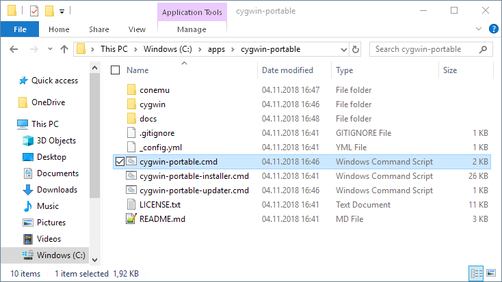

# cygwin-portable-installer <a href="https://github.com/vegardit/cygwin-portable-installer" title="GitHub Repo"></a> <a href="https://ansible.com" title="Ansible"></a> <a href="https://mintty.github.io/" title="MinTTY"></a><a href="https://conemu.github.io/" title="ConEmu"></a> <a href="https://www.cygwin.com/" title="CygWin"></a>

[](LICENSE.txt)

1. [What is it?](#what-is-it)
1. [Features](#features)
1. [Installation](#install)
1. [Update](#update)
1. [License](#license)


## <a name="what-is-it"></a>What is it?

cygwin-portable-installer is a self-containing Windows batch file to perform an unattended installation of a portable [Cygwin](http://cygwin.org) environment.

The installer has been implemented as a Batch script and not PowerShell script because in some corporate environments execution of PowerShell scripts is
disabled for non-administrative users via group policies.


## Features

* **portable**: you can e.g. install it on an USB sticks and use the same configuration on different computers
* **256-color multi-tabbed shell**: [ConEmu](https://conemu.github.io/) is pre-configured as terminal by default. Alternatively you can choose to use the single tabbed [Mintty](https://mintty.github.io/) terminal.
* **command-line package installer**: [apt-cyg](https://github.com/transcode-open/apt-cyg) package manager will be automatically installed (opt-out via config parameter is possible)
* **adaptive Bash prompt**: [bash-funk](https://github.com/vegardit/bash-funk) will be automatically installed (opt-out via config parameter is possible)
* additional tools (opt-out via config parameter is possible):
    * [Ansible](https://github.com/ansible/ansible): deployment automation tool
    * [testssl.sh](https://testssl.sh/): command line tool to check SSL/TLS configurations of servers


## <a name="install"></a>Installation

1. Get a copy of the installer using one of these ways:
   * Using old-school **Copy & Paste**:
      1. Create a local empty directory where Cygwin shall be installed, e.g. `C:\apps\cygwin-portable`
      1. Download the [cygwin-portable-installer.cmd](cygwin-portable-installer.cmd) file into that directory.
   * Using **Git**:
      1. Clone the project into a local directory, e.g.
         ```batch
         git clone https://github.com/vegardit/cygwin-portable-installer --single-branch --branch master --depth 1 C:\apps\cygwin-portable
         ```

1. (Optional) Open the file [cygwin-portable-installer.cmd](cygwin-portable-installer.cmd) in a text editor and adjust the configuration variables to e.g. set an HTTP Proxy, change the set of pre-installed Cygwin packages, select the terminal (ConEmu or Mintty), etc.
1. Execute the `cygwin-portable-installer.cmd`. This will automatically:
    1. download the 32 or 64bit Cygwin setup.exe depending on your OS
    1. install [Cygwin](http://cygwin.org) with the pre-selected set of packages
    1. install the [ConEmu](https://conemu.github.io/) tabbed terminal
    1. create an init scripts that will keep the installation portable
    1. install the [apt-cyg](https://github.com/transcode-open/apt-cyg) command-line package manager
    1. install the [bash-funk](https://github.com/vegardit/bash-funk) Bash toolbox with it's adaptive Bash prompt
    1. install [Ansible](https://github.com/ansible/ansible)
    1. install [testssl.sh](https://testssl.sh/)
1. Now you can launch your portable Cygwin environment using the newly created `cygwin-portable.cmd` batch file.
    


## <a name="update"></a>Updating your installation

To update installed Cygwin packages execute the generated `cygwin-portable-updater.cmd` file.


## <a name="license"></a>License

All files are released under the [Apache License 2.0](LICENSE.txt).
